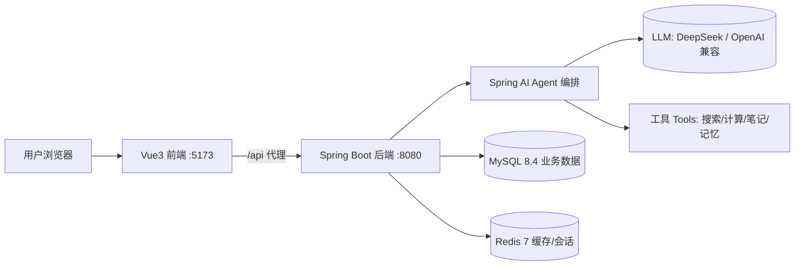

# AI Agent 方案设计（主线 1）

> 更新日期：2026-08-14　目标：从零开发一个**真正可用**的 AI Agent 并发布到互联网。

## 1. 目标与定位

- **产品形态**：网页版 AI 助手 Agent —— 用户通过浏览器与 Agent 对话。
- **Agent 能力（演进路线）**：
  1. M1：基础对话（LLM 调用，可换模型供应商）
  2. M2：Agent 核心 —— 工具调用（Tool Calling）、多轮记忆
  3. M3：会话持久化 + 用户体系（登录、历史会话）
  4. M4：产品化上线 —— 云服务器部署、域名 + HTTPS、日志/监控
- **定位**：做成通用可扩展的 Agent 框架，先跑通端到端，再逐步加能力。

## 2. 总体架构



## 3. 技术栈选型

| 层 | 选型 | 版本 | 说明 |
| --- | --- | --- | --- |
| 前端 | Vue 3 + Vite | Vue 3.5 / Vite 6 | 组合式 API，页面少时先用原生，后续可加 Element Plus |
| 后端 | Spring Boot + Spring AI | Boot 3.5.16 / Spring AI 1.1.7 | 官方 AI Starter，Java 17 |
| LLM | DeepSeek（OpenAI 兼容） | deepseek-chat | 国内可直接访问，key 通过环境变量注入 |
| 数据库 | MySQL | 8.4 LTS | 用户/会话/消息等业务数据（Docker） |
| 缓存 | Redis | 7.x | 会话状态、限流、缓存（Docker） |
| 部署 | 云服务器 + Nginx | - | 反向代理 + HTTPS 证书 |

> 注意：Spring AI 要求 **Java 17+**，本项目统一用 Java 17（与既有 jdk8 工程互不影响，按工程独立选择 JDK）。

## 4. 中间件清单（Docker Compose）

| 中间件 | 镜像 | 端口 | 用途 | 状态 |
| --- | --- | --- | --- | --- |
| MySQL | mysql:8.4 | 3306 | 业务数据 | ✅ 已编排 |
| Redis | redis:7-alpine | 6379 | 缓存/会话 | ✅ 已编排 |
| MongoDB | mongo:7 | 27017 | 文档数据（Agent 记忆） | ⏳ 后续 |
| RabbitMQ | rabbitmq:3-management | 5672/15672 | 异步任务/事件 | ⏳ 后续 |
| Elasticsearch | elasticsearch:8 | 9200 | 全文检索 | ⏳ 后续 |
| MinIO | minio/minio | 9000/9001 | 对象存储 | ⏳ 后续 |

本次 MVP 先把 MySQL + Redis 跑起来，其余按需添加（docker-compose 可增量扩展）。

## 5. 后端设计（Spring Boot + Spring AI）

- 包结构：`com.jam.agent`
  - `controller/`：`ChatController`（POST /api/chat）、`HelloController`（GET /api/ping）
  - `service/`：`ChatService`（封装 ChatClient 调用）
  - `dto/`：请求/响应记录
- Spring AI 接入 OpenAI 兼容协议：`spring.ai.openai.base-url=https://api.deepseek.com`，模型 `deepseek-chat`
- API Key 通过环境变量 `DEEPSEEK_API_KEY` 注入，不写死在代码/配置里；未配置时返回 mock 回复，方便联调。

## 6. 前端设计（Vue 3 + Vite）

- `src/App.vue`：极简聊天页（消息列表 + 输入框 + 发送）
- `src/api/chat.js`：封装 `/api/chat` 调用
- `vite.config.js`：开发代理 `/api` → `http://localhost:8080`，避免跨域

## 7. 目录结构

```
ai-agent/
├── README.md
├── docs/design.md
├── docker/
│   ├── docker-compose.yml     # MySQL + Redis
│   ├── .env.example           # 密码等环境变量模板
│   └── mysql/init/init.sql    # 初始化 SQL
├── backend/                   # Spring Boot 后端
└── frontend/                  # Vue3 前端
```

## 8. 里程碑

| 里程碑 | 内容 | 验收标准 |
| --- | --- | --- |
| M0 环境 | JDK 17、Node 20/22、Docker Desktop | 版本就绪 |
| M1 骨架 | 前后端跑通 + Docker 中间件起 | 页面能对话（mock/真实） |
| M2 Agent | 工具调用、多轮记忆 | 能执行简单工具 |
| M3 数据 | MySQL/Redis 接入、会话持久化 | 刷新后会话还在 |
| M4 上线 | 云服务器 + Nginx + HTTPS | 公网可访问 |

## 9. 环境现状与缺口（2026-08-14 检查）

| 项 | 现状 | 需要动作 |
| --- | --- | --- |
| JDK | 仅 1.8 | 安装 JDK 17（Temurin） |
| Node | 16.17.1 | 安装 Node 20/22 LTS |
| Maven | 3.6.3 | 可复用（配 JDK 17 运行） |
| Docker | 未安装，WSL2 未安装 | 安装 Docker Desktop（管理员 + 可能重启） |

## 10. 验证方式

按用户协作偏好：**build -> run -> verify**，每一步都本地验证通过后再进入下一步。
