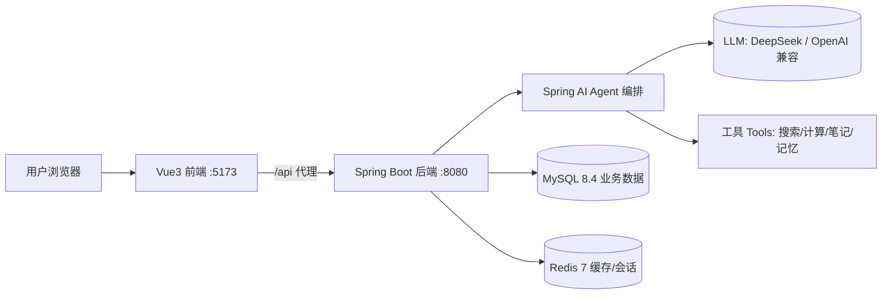

# AI Agent 方案设计（主线 1）

> ## ⚠️ 重要更新（2026-08-25）
>
> 本文件是主线 1 早期"从零开发通用 Agent"的架构设计，**已过时**。当前主线方向已定为「**游戏开发**」，Agent 用于游戏场景。本文保留作**架构演进参考**；最新动态与决策以 `docs/状态.md` 为准。


> 更新日期：2026-08-22　目标：从零开发一个**真正可用**的 AI Agent 并发布到互联网。

## 1. 目标与定位

- **产品形态**：网页版 AI 助手 Agent —— 用户通过浏览器与 Agent 对话。
- **Agent 能力（演进路线）**：
  1. M1：基础对话（LLM 调用，可换模型供应商）
  2. M2：Agent 核心 —— 工具调用（Tool Calling）、多轮记忆
  3. M3：会话持久化 + 用户体系（登录、历史会话）
  4. M4：产品化上线 —— 云服务器部署、域名 + HTTPS、日志/监控
- **定位**：做成通用可扩展的 Agent 框架，先跑通端到端，再逐步加能力。

## 2. 总体架构



## 3. 技术栈选型

| 层 | 选型 | 版本 | 说明 |
| --- | --- | --- | --- |
| 前端 | Vue 3 + Vite | Vue 3.5 / Vite 6 | 组合式 API，页面少时先用原生，后续可加 Element Plus |
| 后端 | Spring Boot + Spring AI | Boot 3.5.16 / Spring AI 1.1.7 | 官方 AI Starter，Java 17 |
| LLM | DeepSeek（OpenAI 兼容） | deepseek-v4-flash | 国内可直接访问，key 通过环境变量或供应商表注入 |
| 数据库 | MySQL | 8.4 LTS | 用户/会话/消息等业务数据（Docker） |
| 缓存 | Redis | 7.x | 会话状态、限流、缓存（Docker） |
| 部署 | 云服务器 + Nginx | - | 反向代理 + HTTPS 证书 |

> 注意：Spring AI 要求 **Java 17+**，本项目统一用 Java 17（与既有 jdk8 工程互不影响，按工程独立选择 JDK）。

## 4. 中间件清单（Docker Compose）

| 中间件 | 镜像 | 端口 | 用途 | 状态 |
| --- | --- | --- | --- | --- |
| MySQL | mysql:8.4 | 3306 | 业务数据 | ✅ 已编排 |
| Redis | redis:7-alpine | 6379 | 缓存/会话 | ✅ 已编排 |
| MongoDB | mongo:7 | 27017 | 文档数据（Agent 记忆） | ⏳ 后续 |
| RabbitMQ | rabbitmq:3-management | 5672/15672 | 异步任务/事件 | ⏳ 后续 |
| Elasticsearch | elasticsearch:8 | 9200 | 全文检索 | ⏳ 后续 |
| MinIO | minio/minio | 9000/9001 | 对象存储 | ⏳ 后续 |

本次 MVP 先把 MySQL + Redis 跑起来，其余按需添加（docker-compose 可增量扩展）。

## 5. 后端设计（Spring Boot + Spring AI）

- 包结构采用“功能模块优先、模块内部轻量分层”，不使用全局 `controller/service/mapper` 横向拆分：

  ```text
  com.jam.agent
  ├── agent          # AgentLoop、工具、记忆、执行服务、Node 持久化
  ├── auth           # 注册登录、Session、安全配置、用户持久化
  ├── conversation   # 会话与 Turn 查询、持久化
  ├── monitoring     # 管理员监控接口与只读统计
  └── common         # 统一 Web 处理、数据库启动迁移等跨模块能力
  ```

- 模块内部按需要使用 `controller`、`service`、`dto`、`persistence`；`persistence` 下再放 Entity、Mapper、Repository。
- Mapper 负责 MyBatis SQL 与数据库行映射，Repository 向业务代码提供有语义的查询和写入方法，并隔离 MyBatis Entity。
- LOOP 聊天执行链为 `ChatController -> AgentRunService -> AgentRunWorker -> AgentTurnPreparer -> AttemptRunner -> AgentLoop -> ModelAdapter`，早期单轮直连模型的 `ChatService` 已删除。
- `AgentTurnPreparer` 在任何 Attempt 之前重建历史、追加当前用户消息并只发布一次 `turn_start`；LOOP 和 WORKFLOW 的每次 Attempt 都复制该消息基线，失败执行不会污染下一次重试。
- 执行链在固定节点发射 `turn_start`、`lifecycle`、`tool_call`、`tool_result`、`assistant`、`generate` 事件；`Dispatcher` 按 `EventRegistry` 调用插件。系统插件（如 `NodeTracePlugin`）恒执行，普通插件由当前 Agent 配方的 `enabled_plugins` 过滤。
- `agent_config` 保存 Agent 配方（`agent_key`、系统提示词、启用插件、启用工具和预留参数），`conversation.agent_key` 保存会话绑定。每次执行将配方捕获到不可变的 `AgentConfigSnapshot`，避免运行过程中配置漂移。
- `agent_config.execution_type` 和 `execution_key` 选择一次执行使用的运行时：`LOOP` 走当前 AgentLoop，`WORKFLOW` 走注册的工作流定义。`AgentRunWorker` 通过 `AgentExecutorRegistry` 路由执行器，公共的会话、记忆、事件和终态落库逻辑不按执行类型复制。
- 工作流实现位于独立的 `com.jam.agent.workflow` 模块，第一版使用代码注册的轻量有向流程，步骤支持 `TOOL`、`MODEL`、`CONDITION` 和 `ANSWER`。工作流步骤通过 `workflow_step_start/end` 事件写入 `WORKFLOW_STEP` 节点，并复用现有 `ToolExecutor`、`ModelAdapter`、`ConversationContextManager` 和 `TurnFinalizer`。
- `agent_config.enabled_tools` 是工具白名单：旧数据中的 `NULL` 表示启用全部已注册工具，显式空数组表示不启用工具，非空数组只暴露并允许执行列出的工具。
- Tool 定义统一放在 `agent.tool.definition` 子包并按领域拆类，所有定义类实现 `AgentToolProvider`；`ToolRegistry` 通过 Spring 注入实现列表并生成不可变 Callback 注册表，`ToolExecutor` 只处理白名单校验、上下文注入、异常包装和事件发布。
- `model_provider_config` 保存模型供应商连接和模型目录，字段包含协议类型、`base_url`、通用 `endpoint_path`、`api_key`、模型 JSON、状态和可选 `user_id`。`user_id = NULL` 是系统供应商，非空是当前用户私有供应商；API Key 支持数据库原值或 `env:变量名` 引用。
- 模型协议与供应商品牌解耦：当前支持 `OPENAI_CHAT_COMPLETIONS` 和 `OPENAI_RESPONSES`，并保留 `ANTHROPIC_MESSAGES` 扩展位。Chat Completions 由 Spring AI 适配，Responses 由原始 JSON 适配器处理 `input`、typed output item、`function_call` 和 `function_call_output`，应用自行维护上下文并固定 `store=false`。
- 内置供应商目录包含 DeepSeek、Zhipu GLM、proaiapi 和呆呆兽中转站。DeepSeek 和 GLM 使用 OpenAI Chat Completions；两个中转站使用 OpenAI Responses。前端只展示脱敏模型目录，协议适配器未注册时才标记为不可用。
- `agent_config` 保存 Agent 默认的供应商、模型名和 temperature；`conversation` 保存用户在该会话最后选择的供应商和模型。新会话未显式选择时使用 Agent 默认值，已有会话未显式选择时沿用会话值，前端显式切换则从下一 Turn 生效。
- `agent_config` 可选保存备用供应商和模型；当前 Turn 的主模型发生超时、限流、过载或模型不存在等临时性故障时，OuterLoop 才允许切换备用模型。下一 Turn 仍从主模型开始，实际成功模型以 assistant Turn 和 MODEL_CALL 节点为准。
- 模型配置在 Turn 提交时固定到独立的 `AgentExecutionContext.modelConfig`，因此同一会话可以切换 Agent 或模型，而运行中的 Turn 不受随后配置变化影响。`ModelRegistry` 按供应商连接缓存客户端，每次调用应用该 Turn 的模型名和 temperature。
- `/api/agents` 返回 Agent 配方的脱敏模型元信息；`/api/models` 返回当前用户可见的扁平模型目录和可用状态，两个接口都不返回 API Key。前端保持两个选择框：切换 Agent 时自动选中该 Agent 默认模型，单独切换模型时保留当前 Agent；不增加“跟随 Agent 默认模型”第三个选项。正式开放用户录入原值 API Key 前必须增加服务端加密存储、所有权校验和脱敏管理接口。
- `agent_config.magic_params` 用于 Agent 级运行参数扩展，当前支持 `loop.maxAttempts`、`loop.maxToolRounds`、`loop.maxToolsPerRound`、`loop.maxRunDurationSeconds`、`loop.maxDegenerateRetries` 和 `loop.maxSameToolSignature`。YAML 中的值作为默认值和安全上限，数据库配置不能超过上限。
- 工作流可通过 `magic_params.workflow.maxSteps` 覆盖步骤预算，但不能超过 YAML 的 `agent.workflow.max-steps` 全局上限。第一版不引入数据库工作流编辑器、BPMN 或中途断点恢复。
- 插件事件使用独立快照，消息上下文使用 `AgentTurnContext`；这保留了并行工具执行能力，并为后续工具拦截、上下文压缩等扩展留下事件槽位。
- 未来 RAG、Skill 作为独立功能模块；Milvus、Redis、模型供应商等技术组件放在所属模块内部，不与业务模块平级。
- Spring AI 默认 Bean 仍由 YAML 提供兜底连接；正常 Agent 执行优先使用数据库供应商与模型配置，API Key 无效时返回 mock 回复，方便联调。

## 6. 前端设计（Vue 3 + Vite）

- `src/App.vue`：聊天、会话侧栏、Agent/模型选择、执行进度和管理员监控入口
- `src/api/chat.js`：封装 `/api/chat` 调用
- `src/api/models.js`：读取当前用户可见的模型目录；会话选择随 `/api/chat` 提交并持久化
- `vite.config.js`：开发代理 `/api` → `http://localhost:8080`，避免跨域

## 7. 目录结构

```text
ai-agent-backend/
├── docs/                      # 设计、里程碑、迭代历史
├── docker/                    # MySQL + Redis 编排
├── src/main/java/com/jam/agent/
│   ├── agent/
│   ├── auth/
│   ├── common/
│   ├── conversation/
│   └── monitoring/
└── src/main/resources/
    ├── mapper/                # 按功能模块继续分目录
    ├── application.yml
    └── schema.sql
```

## 8. 里程碑

| 里程碑 | 内容 | 验收标准 |
| --- | --- | --- |
| M0 环境 | JDK 17、Node 20/22、Docker Desktop | 版本就绪 |
| M1 骨架 | 前后端跑通 + Docker 中间件起 | 页面能对话（mock/真实） |
| M2 Agent | 工具调用、多轮记忆 | 能执行简单工具 |
| M3 数据 | MySQL/Redis 接入、会话持久化 | 刷新后会话还在 |
| M4 上线 | 云服务器 + Nginx + HTTPS | 公网可访问 |

## 9. 环境现状与缺口（2026-08-14 检查）

| 项 | 现状 | 需要动作 |
| --- | --- | --- |
| JDK | 仅 1.8 | 安装 JDK 17（Temurin） |
| Node | 16.17.1 | 安装 Node 20/22 LTS |
| Maven | 3.6.3 | 可复用（配 JDK 17 运行） |
| Docker | 未安装，WSL2 未安装 | 安装 Docker Desktop（管理员 + 可能重启） |

## 10. 验证方式

按用户协作偏好：**build -> run -> verify**，每一步都本地验证通过后再进入下一步。
